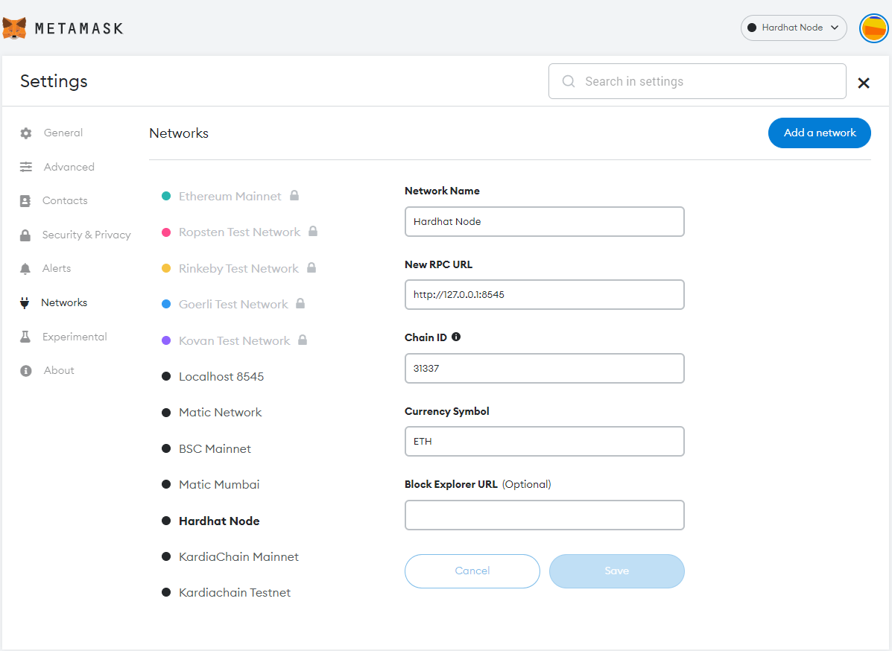

<h1 align="center">HiFi UI (React App for HiFi)</h1>


## 1. Getting Started With The Application

```sh
$ git clone https://github.com/IntelegixLabs/HiFi_UI.git
$ cd HiFi_UI
$ npm i
```

## 2. Getting Started With The Flask API Application

```sh
$ git clone https://github.com/IntelegixLabs/HiFi.git
$ cd HiFi
$ pip install -r requirements.txt
$ python app.py
```

## 3. Project Requirements

<h4>Languages</h4>
<ul>
  <li>JavaScript</li>
  <li>Python 3.12.1</li>
</ul>

<h4>Frameworks</h4>
<ul>
  <li>Node v21.6.2</li>
  <li>Flask v2.3.2</li>
  <li>npm v8.11.0</li>
  <li>React v18.2.0</li>
</ul>


### 4. Boot up local Hardhat development blockchain

```
npx hardhat node
```

### 5. Connect development blockchain accounts to Metamask
- Copy private key of the addresses and import to Metamask
- Connect your metamask to hardhat blockchain, network 127.0.0.1:8545.
- If you have not added hardhat to the list of networks on your metamask, open up a browser, click the fox icon, then click the top center dropdown button that lists all the available networks then click add networks. A form should pop up. For the "Network Name" field enter "Hardhat". For the "New RPC URL" field enter "http://127.0.0.1:8545". For the chain ID enter "31337". Then click save. 

<p align="center">
  
</p>


### 6(a). Migrate Smart Contracts
```
npx hardhat run blockchain/backend/scripts/deploy.Cjs --network localhost
```

### 6(b). Migrate Smart Contracts (Goerli Network)
```
npx hardhat run blockchain/backend/scripts/deploy.cjs --network goerli
```

### 8. Run Tests
```
npx hardhat test
```